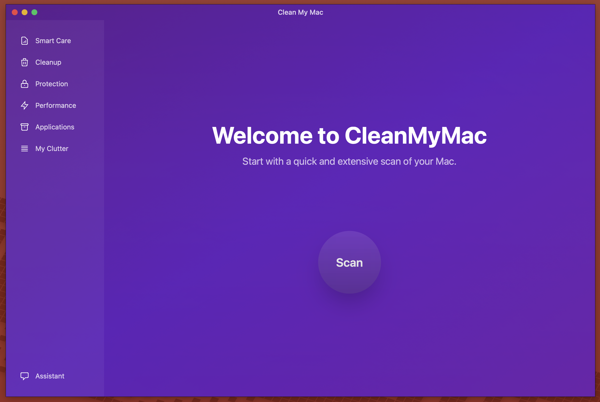
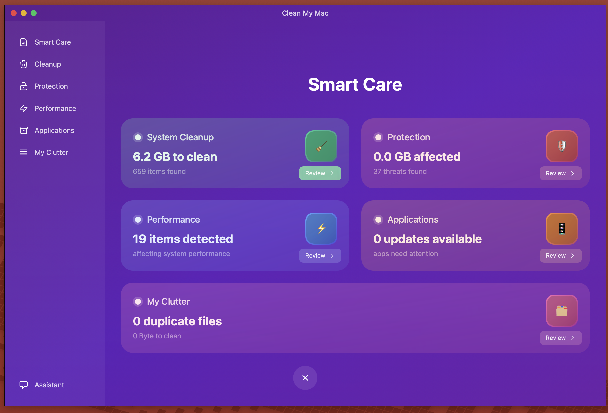
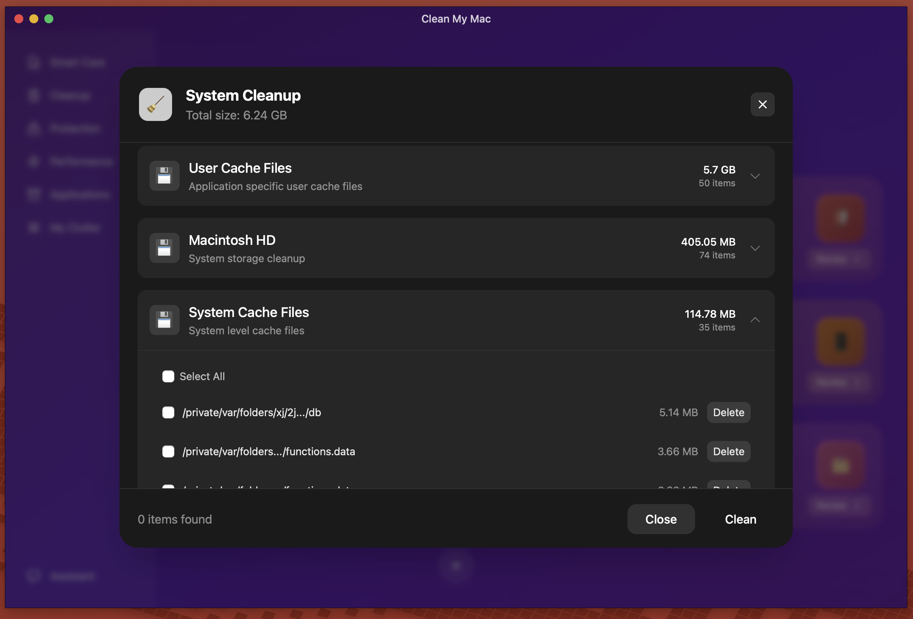

# Clean My Mac

Modern ve güçlü bir Mac temizleme ve optimizasyon uygulaması. Sisteminizi temiz ve performanslı tutmak için tasarlandı.



## 🚀 Özellikler

### 🧹 Smart Care
Sisteminizin genel durumunu tek bir yerden görüntüleyin ve yönetin.



- **System Cleanup**: Gereksiz dosyaları ve önbelleği temizleyin
- **Protection**: Sisteminizi tehditlere karşı koruyun
- **Performance**: Sistem performansını optimize edin
- **Applications**: Uygulamalarınızı güncel tutun
- **My Clutter**: Tekrarlanan ve gereksiz dosyaları bulun

### 🔍 Detaylı Sistem Analizi
Her bir kategori için detaylı analiz ve temizleme seçenekleri.



## 💻 Kurulum

1. En son sürümü [buradan](https://github.com/yourusername/clean-my-mac/releases) indirin
2. DMG dosyasını açın
3. Clean My Mac uygulamasını Applications klasörüne sürükleyin
4. Uygulamayı başlatın

## 🛠️ Geliştirme

Bu proje [Tauri](https://tauri.app) + [Svelte](https://svelte.dev) + [TypeScript](https://www.typescriptlang.org/) kullanılarak geliştirilmiştir.

### Gereksinimler

- Node.js (v16 veya üzeri)
- Rust
- macOS için geliştirme araçları

### Geliştirme Ortamını Hazırlama

```bash
# Bağımlılıkları yükleyin
npm install

# Geliştirme modunda çalıştırın
npm run tauri dev

# Uygulamayı derleyin
npm run tauri build
```

## 📝 Lisans

MIT License. Daha fazla bilgi için `LICENSE` dosyasına bakın.

## 🤝 Katkıda Bulunma

1. Bu projeyi fork edin
2. Feature branch'i oluşturun (`git checkout -b feature/amazing-feature`)
3. Değişikliklerinizi commit edin (`git commit -m 'feat: add amazing feature'`)
4. Branch'inizi push edin (`git push origin feature/amazing-feature`)
5. Pull Request oluşturun

## 🔒 Güvenlik

Güvenlik açığı bulduysanız, lütfen doğrudan maintainer'lara ulaşın.

